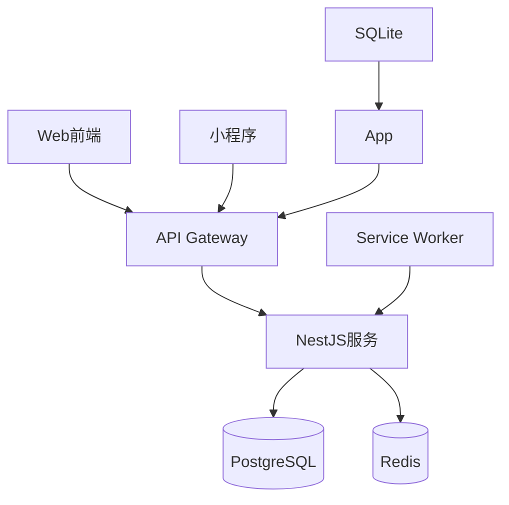

# 技术架构设计文档 (RFC)

## 一、系统架构图


## 二、关键技术决策
### 2.1 离线同步策略
1. **数据流**:
   - 客户端变更 → IndexedDB/SQLite
   - 网络恢复 → 批量上传变更日志
   - 服务端合并 → 版本冲突检测

2. **冲突解决**:
```typescript
interface ConflictResolution {
  entity: string;
  strategy: 'LAST_WRITE_WIN' | 'BUSINESS_RULES';
  fields: Record<string, ConflictHandler>;
}
```

## 三、API规范
### 3.1 内部接口
- 协议: tRPC
- 鉴权: JWT + RBAC
- 错误码: 标准化错误体系

### 3.2 外部接口
- 协议: OpenAPI 3.0
- 文档: Swagger UI自动生成

## 四、部署方案
1. **开发环境**:
   ```bash
   docker-compose -f docker-compose.dev.yml up
   ```
2. **生产环境**:
   ```bash
   ansible-playbook deploy.yml
   ```

## 五、验收标准
1. [x] Mermaid架构图
2. [ ] 同步PoC验证
3. [ ] 安全审计报告