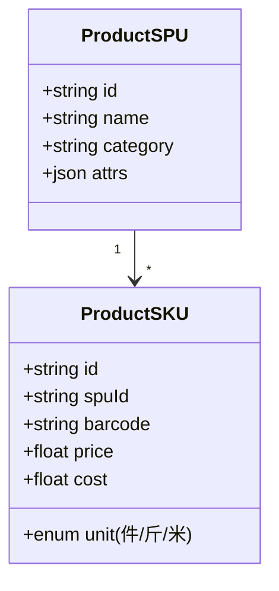

# 产品需求文档 v1 (PRD)

## 一、核心模块设计
### 1.1 商品管理

### 1.2 会员体系
**关键模型**:
- 积分规则: 消费1元=1积分
- 等级成长: 铜/银/金（对应不同折扣）
- 储值卡: 支持充值赠送（充100送10）

## 二、原型范围
### 2.1 Web后台
1. **商品管理页**:
   - 分类树形导航
   - 批量导入/导出
2. **POS收银页**:
   - 扫码枪对接
   - 挂单列表

### 2.2 小程序
1. **会员中心**:
   - 积分查询
   - 储值充值
2. **点单页**:
   - 购物车浮动窗口

## 三、验收标准
| 模块       | 指标                  | 测试方法               |
|------------|-----------------------|------------------------|
| POS收银    | ≤3步完成下单          | 计时测试               |
| 库存同步   | 断网后1分钟内恢复     | 网络模拟               |
| 财务报表   | 生成时间＜5秒         | 1000条数据压力测试     |

## 四、非功能性需求
1. **性能**:
   - 3G网络下首屏加载＜2.5s
   - 并发收银支持10人同时操作
2. **安全**:
   - 日结数据防篡改
   - 敏感操作二次验证